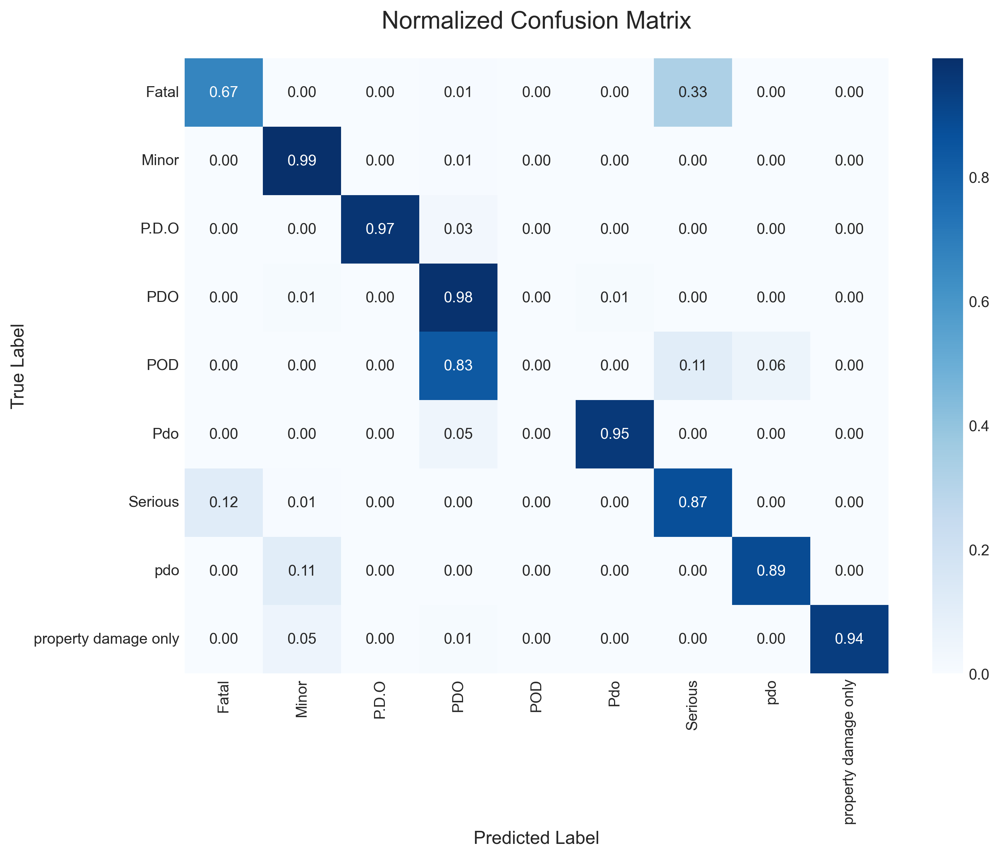
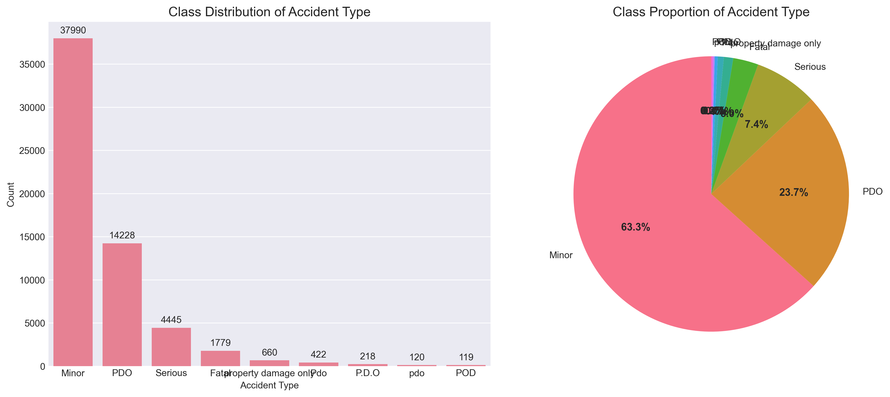
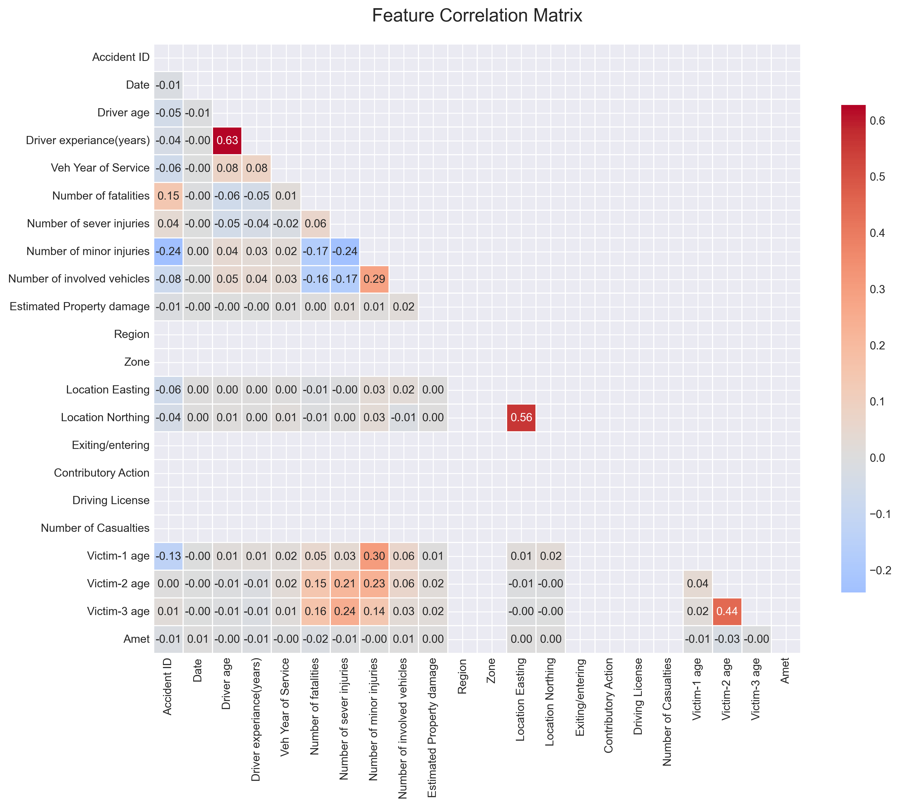
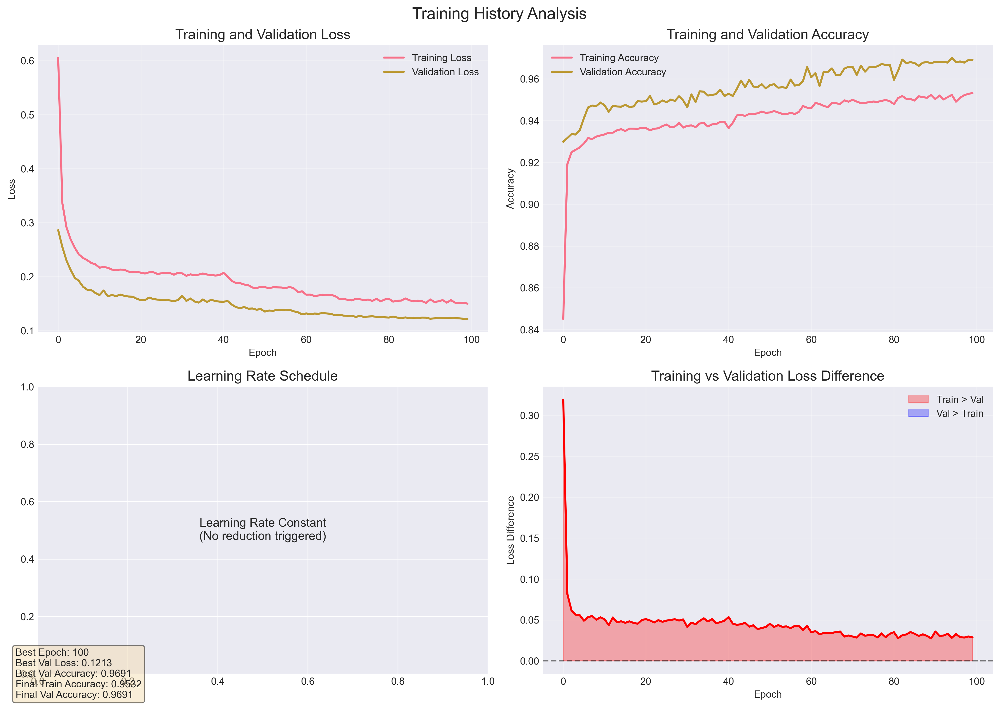

# Neural Network-Based Classification Project

This project focuses on applying neural network techniques to a provided dataset to build, train, and evaluate a classification model. The project demonstrates a comprehensive understanding of data preprocessing, model design, training protocols, evaluation, and interpretation.

## Objective

The primary objective of this project is to apply neural network techniques to a given dataset to build, train, and evaluate a classification model. This includes demonstrating an understanding of data preprocessing, model design, training protocols, evaluation, and interpretation.

## Dataset

The dataset used in this project is `CrashData.xlsx`, located in the `data/` directory.

## Project Structure

The project is organized as follows:

```
├───data
│   └───CrashData.xlsx
├───src
│   ├───data_loader.py
│   ├───data_preprocessor.py
│   ├───model_builder.py
│   ├───trainer.py
│   ├───evaluator.py
│   └───utils.py
├───outputs
│   ├───models
│   ├───processed_data
│   └───visualizations
├───reports
├───main.py
├───config.py
└───README.md
```

-   **`data/`**: Contains the raw dataset.
-   **`src/`**: Contains the source code for the project, divided into modules for data loading, preprocessing, model building, training, and evaluation.
-   **`outputs/`**: Contains the processed data, trained models, and visualizations generated during the project.
-   **`reports/`**: Contains reports and summaries generated from the analysis.
-   **`main.py`**: The main script to run the entire pipeline.
-   **`config.py`**: Configuration file for the project.
-   **`README.md`**: This file.

## Tasks

The project is divided into the following tasks:

1.  **Data Understanding (Exploratory Data Analysis):** Loading, examining, and understanding the dataset.
2.  **Data Preparation:** Cleaning, preprocessing, and splitting the dataset.
3.  **Model Design:** Architecting a neural network for the classification task.
4.  **Training Process:** Training the model and monitoring its performance.
5.  **Evaluation:** Evaluating the model's performance on the test set.
6.  **Interpretation and Reporting:** Analyzing the results and summarizing the findings.

## Visualizations

This project includes various visualizations to aid in understanding the data, model performance, and results. Preview images of key visualizations will be provided here, such as:

-   **Confusion Matrix:**
    
-   **Class Distribution:**
    
-   **Correlation Heatmap:**
    
-   **Training History:**
    

*(Note: These are placeholders. Actual images will be generated and linked upon project execution.)*

## Installation

To run this project, you need to have Python and the required libraries installed. You can install the libraries using pip:

```bash
pip install -r requirements.txt
```

*(Note: If a `requirements.txt` file is not yet present. It should be created to list all the project dependencies.)*

## Usage

To run the entire pipeline, execute the `main.py` script:

```bash
python main.py
```

This will perform all the tasks from data loading to evaluation and generate the outputs in the `outputs/` and `reports/` directories.
